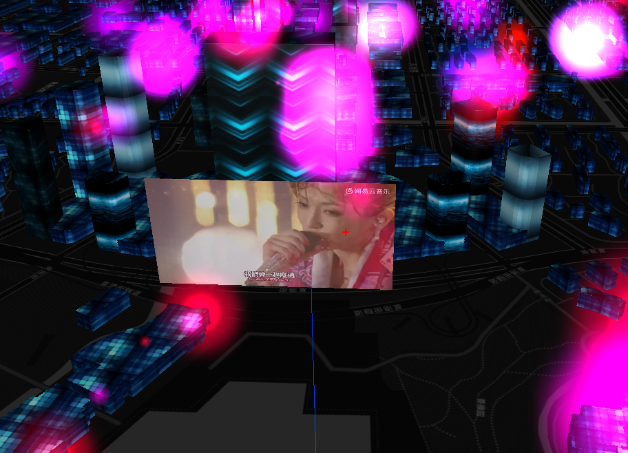

# this is maptalks.three example test

this is maptalks.three examples,is base on https://github.com/maptalks/maptalks.three

## Examples

* [Extrude Buildings](https://maptalks.github.io/maptalks.three/demo/buildings.html).
* [Load MTL Model](https://maptalks.github.io/maptalks.three/demo/obj.html).
* [More Examples](https://maptalks.github.io/maptalks.three/demo/obj.html).

